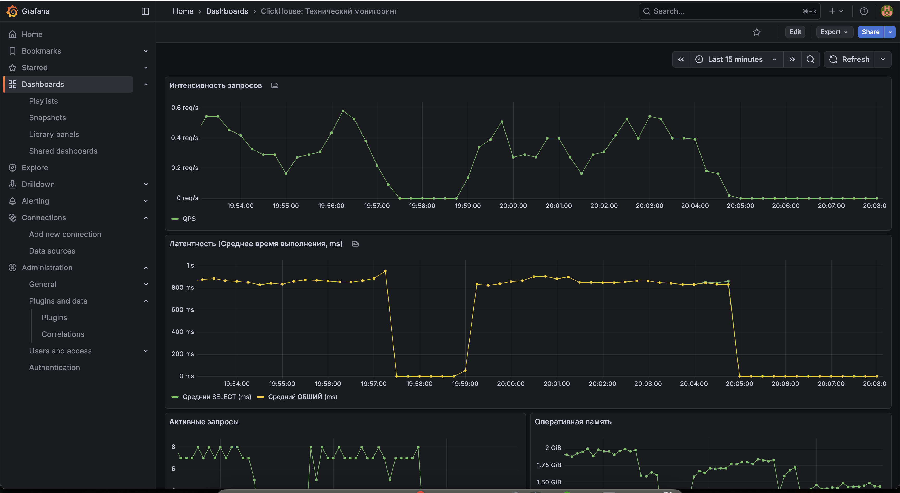
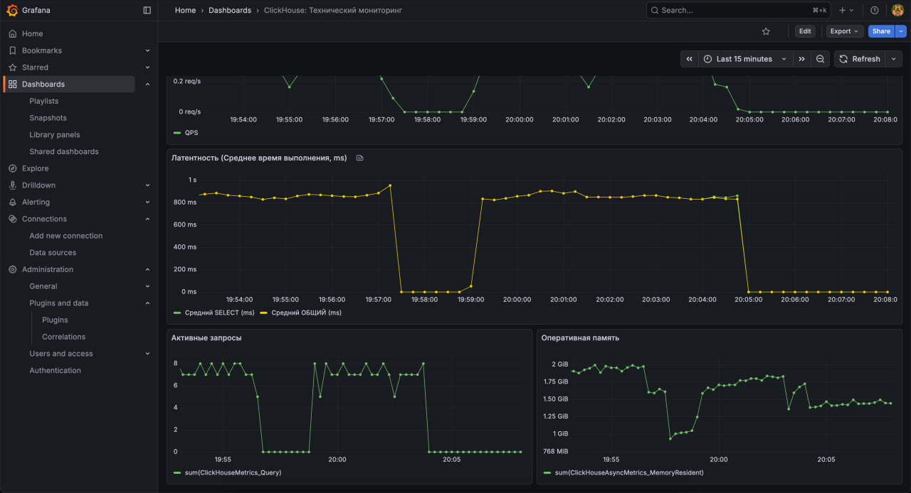
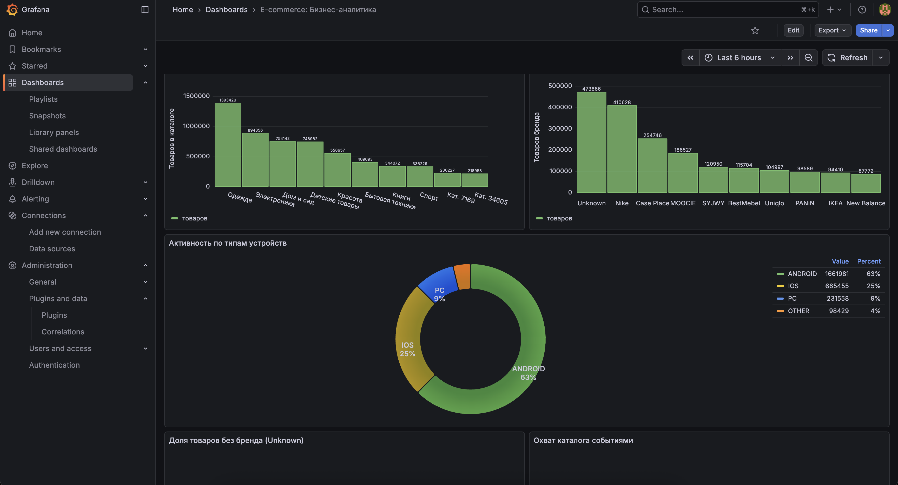
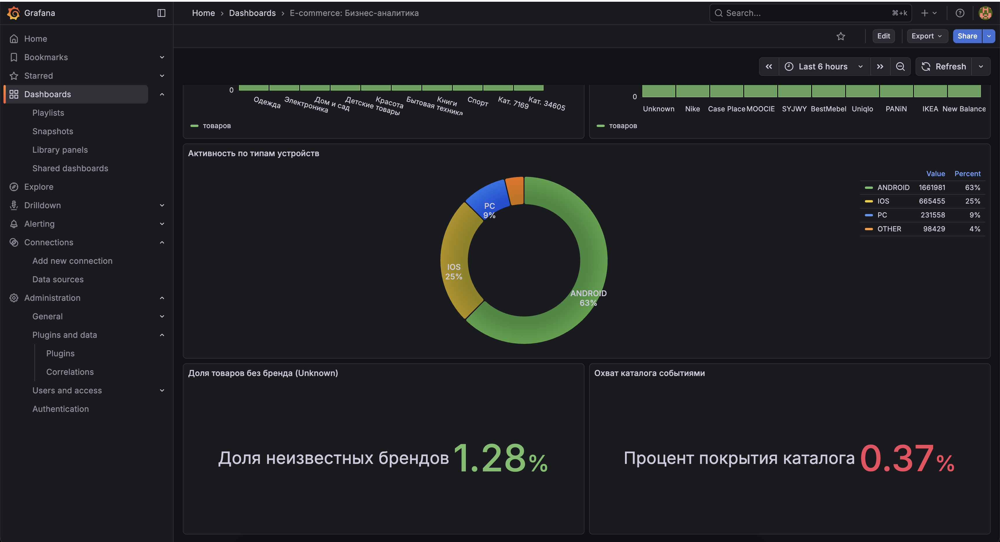

# Практическая работа №3: ClickHouse для анализа e-commerce данных

## �� Цель работы
Освоить колоночную СУБД **ClickHouse** на реальных данных интернет-магазина, настроить материализованные представления для ускорения аналитических запросов, внедрить мониторинг производительности через **Prometheus** и **Grafana**.

---

## 📂 Исходные данные

Система строится на анализе двух наборов данных (формат CSV и Parquet):

1.  **`EcomOffer`** — каталог товаров за сутки (36.8 млн строк).
    * Поля: `offer_id`, `price`, `seller_id`, `category_id`, `vendor`.
2.  **`RawEvent`** — события пользователей (2.6 млн строк).
    * Поля: `Hour`, `DeviceTypeName`, `ApplicationName`, `OSName`, `ProvinceName`, `ContentUnitID`.
3.  **Связь данных:** `ContentUnitID` (события) = `offer_id` (каталог).

---

## 📝 Техническое задание и реализация

### 1. Инфраструктура
Развернут `docker-compose.yml` со следующими сервисами:
* **ClickHouse** (порты: `8123` — HTTP, `9363` — Metrics, `9000` — Native).
* **Prometheus** (порт: `9090`).
* **Grafana** (порт: `3000`).

```bash
docker-compose up -d
```

### 2. Модель данных ClickHouse
Созданы таблицы с использованием движков семейства MergeTree.

#### Таблица `ecom_offers` (Каталог товаров)
* **Движок:** `ReplacingMergeTree`
* **Пример данных:**

| offer_id | price | seller_id | category_id | vendor |
| :--- | :--- | :--- | :--- | :--- |
| 151350 | 1163.0 | 0 | 40035 | Эксмо |
| 1724200 | 120.0 | 0 | 40016 | Попурри |

#### Таблица `raw_events` (События пользователей)
* **Движок:** `MergeTree`

```bash
# 1. Создание таблиц
cat scripts/1_create_tables.sql | docker exec -i clickhouse clickhouse-client -n

# 2. Создание пользователя admin для внешних систем (Python/Grafana)
docker exec -i clickhouse clickhouse-client -q "CREATE USER IF NOT EXISTS admin IDENTIFIED WITH plaintext_password BY 'admin'; GRANT ALL ON ecom.* TO admin;"
```

### 3. Загрузка данных
Импорт ~37 млн записей каталога и ~2.6 млн событий.
```bash
# Загрузка каталога (CSV)
docker exec -i clickhouse clickhouse-client --query="INSERT INTO ecom.ecom_offers FORMAT CSVWithNames" < data/10ozon.csv

# Загрузка событий (Parquet)
docker exec -i clickhouse clickhouse-client --query="INSERT INTO ecom.raw_events FORMAT Parquet" < data/*.parquet
```

### 4. Оптимизация (Materialized Views)
Созданы МВ для ускорения агрегации по категориям и брендам на базе `AggregatingMergeTree`.
**Файл:** `scripts/3_create_mv.sql`
```bash
cat scripts/3_create_mv.sql | docker exec -i clickhouse clickhouse-client -n
```

### 5. Аналитические запросы
Реализованы SQL-запросы в файле `scripts/4_analytic_queries.sql`:
1. Топ-20 категорий по количеству товаров.
2. Топ-30 брендов по количеству товаров.
3. Среднее количество товаров по брендам в категориях.
4. Анализ товаров без пользовательских событий.

**Результаты анализа:**
* **Общее количество товаров:** 36,876,834
* **Товары без событий:** 36,740,067 (99% каталога не имеет активности).
* **Топ брендов:** Nike (410к), Case Place (254к), MOOCIE (186к).

### 6. Тестирование производительности
Сравнение времени выполнения запросов к сырым данным vs Materialized Views (`scripts/performance_test.py`).

| Метрика | Raw Data (Full Scan) | Materialized View | Ускорение |
| :--- | :--- | :--- | :--- |
| **Средняя задержка** | 142.35 мс | **9.86 мс** | **14.4x** |
| **QPS (Запросов/сек)** | 7.03 | **101.40** | **14.4x** |

### 7. Мониторинг Grafana
Развернуто два дашборда для разделения технического состояния и бизнес-аналитики.

**Dashboard A: Technical Stack (Prometheus)**
* Метрики: QPS, Active Queries, Memory Usage (Resident).

**Dashboard B: Business Insights (ClickHouse SQL)**
* Метрики: Top Categories, Top Vendors, Catalog Coverage.

**Инструкция по восстановлению:**
1. Добавить Data Source ClickHouse (`http://clickhouse:8123`, UID: `af7scv6rf1ipsb`).
2. Выполнить код из `scripts/setup_grafana.js` в консоли браузера (F12).

---

## 8. Проверка состояния системы
```bash
# Список таблиц и MV
docker exec -i clickhouse clickhouse-client -q "SHOW TABLES FROM ecom"
# Проверка наполненности
docker exec -i clickhouse clickhouse-client -q "SELECT count() FROM ecom.ecom_offers"
```

---
**Вывод:** В ходе работы подтверждена эффективность колоночных СУБД для OLAP-задач. Использование Materialized Views позволило сократить время отклика системы в 14.4 раза и обеспечить стабильную работу при 100+ RPS на данных объемом 37 млн строк.


# Итоги
## Технический борд



## Бизнесовый борд


