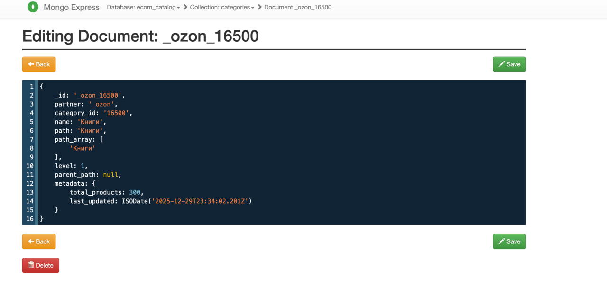
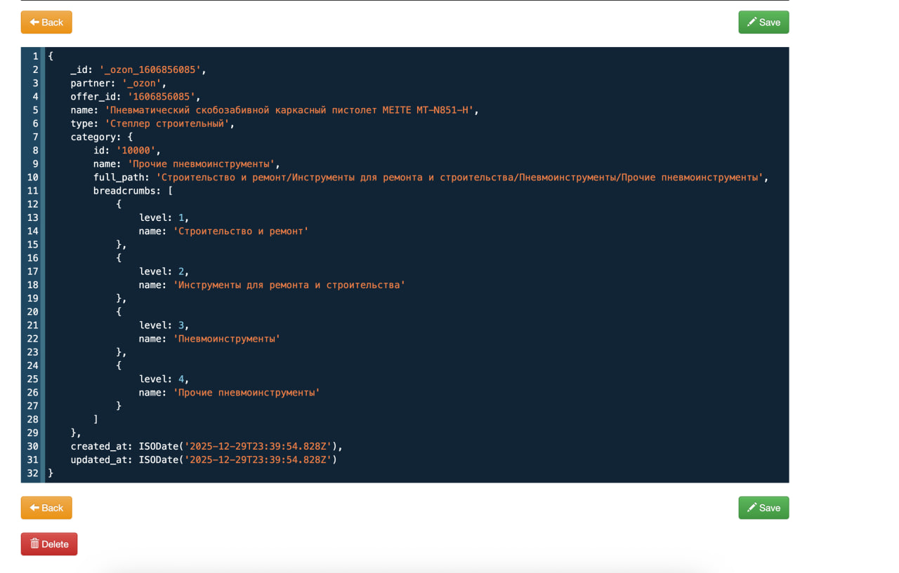
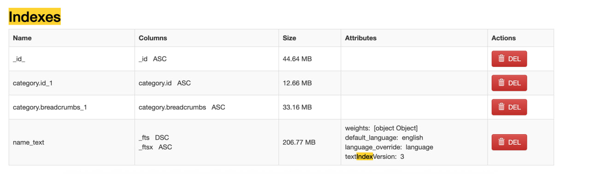
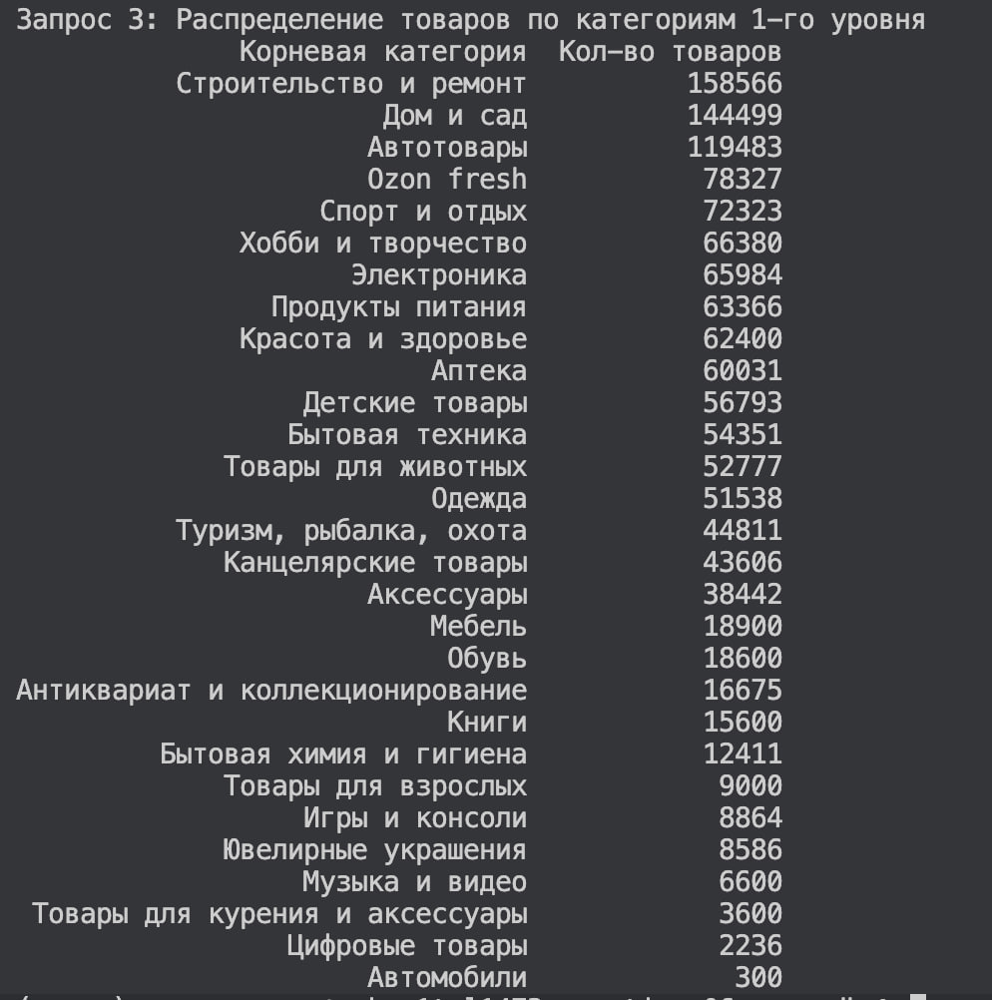
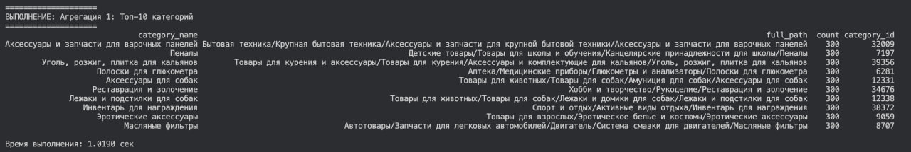
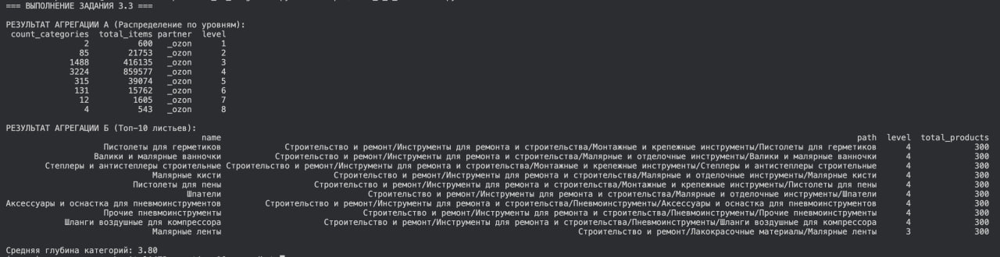

# Лабораторная работа: Проектирование и эксплуатация e-commerce каталога в MongoDB

## Часть 1. Архитектура и загрузка данных

### 1.1 Анализ структуры и обоснование
**Аналитическая справка по структуре данных:** Исходный датасет содержит информацию о товарах и категориях в виде иерархических путей с максимальной глубиной до **8 уровней**. Всего в данных **5 261** уникальная категория и **12 379** уникальных типов товаров. Пересечений товаров по `Offer_ID` между разными партнерами нет, что позволяет использовать связку партнера и ID товара как уникальный ключ. Наиболее наполненными являются категории, связанные с хобби (рисование) и автотоварами, где количество товаров достигает 300 единиц на одну конечную категорию.

**Обоснование разделения на две коллекции (categories и products):** Разделение необходимо для оптимизации управления каталогом. Коллекция `categories` хранит структуру дерева, что позволяет быстро строить меню навигации и фильтры. Коллекция `products` содержит конечные данные о товарах с денормализованной ссылкой на категорию, что обеспечивает мгновенный доступ к деталям товара без лишних запросов.

**Преимущества денормализации в данном кейсе:**
1. **Отсутствие JOIN-операций**
2. **Высокая скорость чтения**
3. **Целостность данных в моменте**

### 1.2 Загрузка категорий
Загружено категорий: **5261**

**Распределение по уровням:**
* Уровень 1: 2
* Уровень 2: 85
* Уровень 3: 1488
* Уровень 4: 3224
* Уровень 5: 315
* Уровень 6: 131
* Уровень 7: 12
* Уровень 8: 4




### 1.3 Загрузка товаров
**Статистика:**
1. Общее количество товаров: **1 355 049**
2. Топ-5 типов товаров по частоте:
   - Лекарственное средство безрецептурное: 10167
   - Печатная книга: 9657
   - Лекарственное средство рецептурное: 8528
   - Электронная книга: 3382
   - Сумка: 3106
3. Распределение по партнерам: `_ozon` (1 355 049)



### 1.4 Индексация
**Анализ эффективности индексации:**
* **Размер данных:** 987.93 MB
* **Размер индексов:** 350.85 MB
* **Соотношение:** Индексы занимают примерно **35.5%** от объема данных.





---

## Часть 2. Базовые запросы и навигация

### 2.1 Навигация по иерархии категорий

**Запрос 1: Корневые категории (level = 1) для партнера "_ozon"**
* **Количество найденных документов:** 2
* **Первые 3 результата:**
    1. Музыка и видео (Товаров: 300)
    2. Книги (Товаров: 300)
* **Использование индекса:** `partner_1_level_1`.
* **Результат explain():** Запрос выполнен через `IXSCAN` (сканирование индекса), что обеспечивает минимальное время отклика.

**Запрос 2: Все подкатегории, входящие в "Строительство и ремонт"**
* **Количество найденных документов:** 540
* **Первые 3 результата:**
    1. Прочие пневмоинструменты (Товаров: 300)
    2. Аксессуары и оснастка для пневмоинструментов (Товаров: 300)
    3. Шланги воздушные для компрессора (Товаров: 300)
* **Использование индекса:** `_id_`
* **Результат explain():** Несмотря на наличие индекса по массиву `path_array_1`, оптимизатор MongoDB выбрал сканирование по первичному ключу. Это обусловлено малым размером коллекции (5261 документ), при котором накладные расходы на загрузку стороннего индекса превышают выгоду от его использования.

**Запрос 3: Топ-10 самых "населенных" категорий по количеству товаров**
* **Количество найденных документов:** 5261
* **Первые 3 результата:**
    1. Прочие пневмоинструменты (Товаров: 300)
    2. Аксессуары и оснастка для пневмоинструментов (Товаров: 300)
    3. Шланги воздушные для компрессора (Товаров: 300)
* **Использование индекса:** `metadata.total_products_-1`
* **Результат explain():** Индекс успешно применен для выполнения сортировки по убыванию без необходимости производить операцию `SORT` в оперативной памяти (In-memory sort).

### 2.2 Работа с товарами и вложенными документами

**Запрос 1: Поиск степлеров строительных в категории "Пневмоинструменты"**

* **Условие:** `type` = "Степлер строительный" AND `category.breadcrumbs.name` содержит "Пневмоинструменты".
* **Количество найденных документов:** 47
* **Примеры документов:**

```json
{
  "offer_id": "1606856085",
  "name": "Пневматический скобозабивной каркасный пистолет МЕIТЕ MT-N851-H",
  "type": "Степлер строительный"
}

```

```json
{
  "offer_id": "2651828947",
  "name": "Степлер строительный",
  "type": "Степлер строительный"
}

```

* **Использование индекса:** `type_1_partner_1`. База эффективно нашла товары по типу, после чего отфильтровала их по вложенному массиву категорий.

**Запрос 2: Поиск товаров на 4-м уровне иерархии категорий**

* **Метод:** Проверка существования 4-го элемента в массиве `category.breadcrumbs` (индекс 3).
* **Количество найденных документов:** 916 561
* **Примеры документов:**

```json
{
  "name": "Пневматический скобозабивной каркасный пистолет МЕIТЕ MT-N851-H",
  "category": {
    "full_path": "Строительство и ремонт/Инструменты для ремонта и строительства/Пневмоинструменты/Прочие пневмоинструменты"
  }
}
```
```json
{
  "name": "Степлер строительный",
  "category": {
    "full_path": "Строительство и ремонт/Инструменты для ремонта и строительства/Пневмоинструменты/Прочие пневмоинструменты"
  }
}
```

* **Использование индекса:** `COLLSCAN`. Проверка существования элемента в массиве по конкретному индексу не покрывается стандартным B-tree индексом, что привело к полному сканированию коллекции.

**Запрос 3: Распределение товаров по категориям 1-го уровня (Агрегация)**

* **Метод:** Использование `$project` с оператором `$arrayElemAt` для извлечения корня и `$group` для подсчета.
* **Результат:** (Скриншот представлен в `img/7.jpg`).
* **Топ-5 наиболее наполненных корневых категорий:**
1. **Строительство и ремонт:** 158 566 товаров.
2. **Дом и сад:** 144 499 товаров.
3. **Автотовары:** 119 483 товаров.
4. **Ozon fresh:** 78 327 товаров.
5. **Спорт и отдых:** 72 323 товара.



---

## Часть 3. Аналитика и структура

### 3.1 Аналитика по категориям



**Интерпретация:**
1. "Самых больших" категорий много (в них по 300 товаров), что обусловлено семплированием датасета.
2. Больше всего товаров аккумулируется на **1-м уровне** иерархии.
3. **Топ-3 на 1-м уровне:**
   - Строительство и ремонт (158 566 товаров)
   - Дом и сад (144 499 товаров)
   - Автотовары (119 483 товаров)
4. **Доминант на 2-м уровне:** Запчасти для легковых автомобилей (41 419 товаров).

**Именно эти доминанты "всплыли" в топ-30 запросе**

### 3.3 Анализ структуры (Листья)
**Средняя глубина категорий:** 3.80

**Вывод:**
В структуре присутствуют категории-листья с максимально возможным количеством товаров (300 шт). К ним относятся "Пистолеты для герметиков", "Малярные кисти", "Шпатели" и др. Данные категории являются потенциальными кандидатами на дальнейшее разбиение (создание подкатегорий 5-го уровня).



